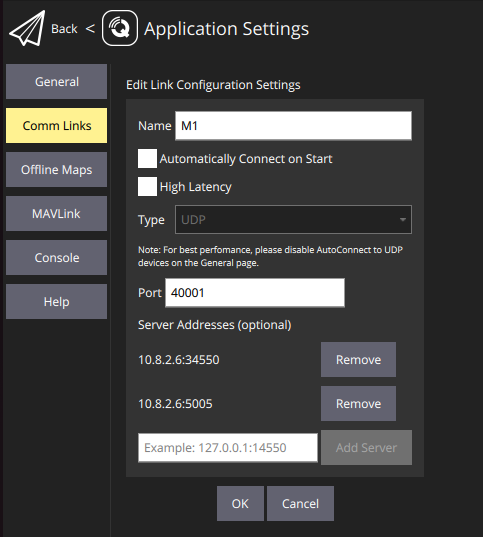

#############
Prerequisites
#############

VPN connection
==============

Latest BeagleGroundControl
==========================

1. Connect to the drone via BeagleGroundControl by clicking on the beagle logo > Application Settings > Comm Links and choosing the correct drone to connect to.
2. If there is no drone profile yet, add a new profile with the drone name, a unique port (e.g. drone number plus 40000) and 2 server addresses: the drone IP on port 34550 and the drone IP on port 5005.

3. The next steps are potentially dangerous, so make sure the propellers are detached
4. Click on the beagle logo > Analyze Tools > MAVLink Console
5. Any hardware check that is labelled with "PX4 shell" will take place here in the MAVLink Console. For a first example and to check connectivity, type the following to get a list of available commands:

.. code-block:: sh

   help

