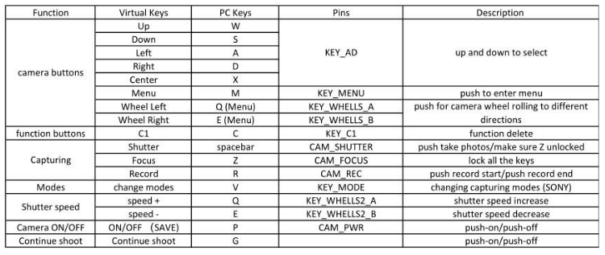

#########################
ADTi 61S (SONY ILCE-7RM4)
#########################

Hardware Connection
===================

1. Connect 8 pin splitter cable from orignal packet, one of the cable marked Uart RX/TX and GND; connect Uart to an USB-TTL bridge, and plugin to Debug PC usb for initial setting
2. Connect mini HDMI to HDMI cable to CamLink, for Debugging and live view
3. Connect USB-C to USB cable to Jetson NANO, for connecting SONY SDK

Preparation for SONY SDK
========================
CMAKE version must be 3.17.3, check how to build cmake if you need to

.. code-block:: sh

   sudo apt install autoconf libtool libudev-dev gcc g++ make cmake unzip libxml2-dev

[Ubuntu (for Embedded)]
Change “APPEND ${cbootargs} quiet” to the command
below in the file “/boot/extlinux/extlinux.conf”.

.. code-block:: sh

   sudo vim /boot/extlinux/extlinux.conf

Before:
APPEND ${cbootargs} quiet
After:
APPEND ${cbootargs} usbcore.usbfs_memory_mb=150 usbcore.autosuspend=-1

Check the configuration after reboot/reload the kernel image

.. code-block:: sh

   sudo reboot
   cat /sys/module/usbcore/parameters/usbfs_memory_mb
   # should be 
   150

Software Debugging configuration
================================

1. Serialport from the splitter cable, helps getting into camera menu and change some basic settings there

   Baud rate: 115200

   protocol: ASCII

2. HDMI can direct connect to a monitor or open video player through the connection of CamLink

.. code-block:: sh

   ffplay /dev/video<*>

3. USB-C cable is the one we can communicate with SONY SDK after the remote setting in camera set to USB

Quickstart of SONY SDK example
==============================

Download version v1.7 from sony website:

.. code-block:: sh

   https://support.d-imaging.sony.co.jp/app/sdk/licenseagreement_d/en.html

We will use it with Jetson NANO, so choose linux ARMv8 version

Unzip the file and find all the examples inside

Important camera settings for Usage
===================================

.. list-table:: Title
   :widths: 30 30 40
   :header-rows: 1

   * - Parameter Name
     - Setting
     - Comment

   * - File Format
     - JPEG
     - set to JEPG for now to save some space on SD card

   * - JPEG Quality
     - Extra FINE
     -

   * - Silent Shooting
     - on
     - save life cycle of shutter

   * - AF mode
     - AF_S (single)
     - 

   * - PC Remote Cnct Method
     - USB
     - after this setting, we can use sony sdk via USB-C cable
   
Known issues
============

1. Sometime it stuck in the language select page after power cycle, then we cannot connect it through SDK

   solution: after power cycle, if the lens does not come out, click the physical shutter button next to the power switch

