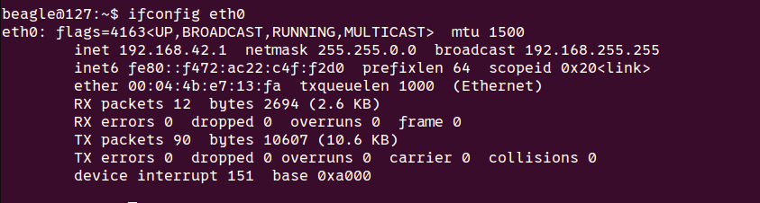

.. _sony_ilxlr1-label:

##################
Sony ILX-LR1 Setup
##################

Preparation for SONY SDK
========================

Connect a monitor to the HDMI output of the Sony camera to do the initial settings.

Timezone and date
-----------------

Timezone is set to Berlin/Paris and date format to D-M-Y.

Network settings
----------------

Press the Menu button, choose the green icon on the left and enable PC remote function.

.. image:: images/sonyilxlr1/network_pc_remote.png

Enable USB-LAN/Tethering and make sure it is connected.

Next, enable the USB-LAN to connect on launch.

We proceed with displaying the Wired LAN info. The IP address is currently set automatically,
which we will have to adjust later on. Write down the MAC address for the device.

On the drone, find out the network settings for the ethernet connection.

Now proceed to set the IP of the camera manually to some IP address in the same network.

Authentication
--------------

We have to find out the device's individual username and password.

For example:

Write down the usernamen and the password.

Silent mode
-----------

In the shooting menu, enable silent shooting mode.

Redis settings
--------------

Add a new camera to `root:payload:configuration` and apply the IP address, MAC address,
username and password that you have written down. The broadcast port has to be modified
as well to a value given to you by someone taking care of the media server (Matt or David).

.. code-block:: json

   {
       ... ,
     "cam1": {
        "type": "sony_ilxlr1",
        "ip": "192.168.42.6",
        "mac": "20:7B:D2:97:DE:7A",
        "username": "R49k2a",
        "password": "4zd5tKES",
        "enabled": true,
        "mavlink_comp_id": 100,
        "stream": {
            "flip": false,
            "bitrate": 200000,
            "framerate": 30,
            "stream_height": 480,
            "stream_width": 720,
            "source_device": "/dev/payload",
            "source_width": 720,
            "source_height": 480,
            "type": "v4l2",
            "allow_broadcast": true,
            "allow_record": true,
            "record_udp_port": 40101,
            "broadcast_address": "10.8.1.68",
            "broadcast_port": 5811
        }
   }

