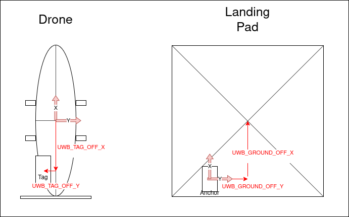

NXP UWB Precland Feature Documentation
======================================

This documentation provides a guide on setting up and using the NXP UWB precland system on the Beagle drones.

1. Tag / Drone Setup
--------------------
To enable the UWB precland feature, configure the following PX4 parameters and perform the hardware setup:

PX4 Parameters
~~~~~~~~~~~~~~
- **UWB_PORT_CFG**: Set the serial port for UWB communication.
- **LTEST_SOURCE**: Select the data source (`ir_lock`, `uwb`, `external`).

  - **ir_lock**: data from uORB **irlock_report** topic
  - **uwb**: data from uORB **sensor_uwb** topic
  - **external**: data from **landing_target_pose** topic
- **LTEST_UWB_SOURCE**: Set the source for UWB data (either `ground` or `drone` side for Cartesian conversion).

  - Ground side seems to give more reliable data and should be used.
  - If set to "Ground side (anchor)", setting the ground module heading using `LTEST_GND_HEAD` is **critical** for a working system!.
- Set the drone module (tag) orientation with **UWB_SENS_ROT**.

- Set the local FRD coordinates offset from the drone center with **UWB_TAG_OFF_X**, **UWB_TAG_OFF_Y**, **UWB_TAG_OFF_Z**.

Hardware Setup
~~~~~~~~~~~~~~
Ensure the UWB tag is securely mounted on the drone with the correct offsets configured as above. Make sure the PCB antenna has an unobstructed FOV of 120° downwards.
The UWB tag needs to be mounted level to the XY plane of the drone!

Wiring
~~~~~~

2. Anchor / Ground Setup
------------------------

Configure the following PX4 parameters for setting up the UWB anchor on the ground or in the hangar:

PX4 Parameters
~~~~~~~~~~~~~~
- **UWB_GND_OFF_X**, **UWB_GND_OFF_Y**, **UWB_GND_OFF_Z**: Define the desired landing location relative to the FRD coordinates of the anchor.
- **LTEST_GND_HEAD**: Compass reading of the ground module. **Needs to be set right in order to make UWB precland work**.

3. Test
-------
- Place the drone in the middle of the landing surface.
- Check the `sensor_uwb` uORB topic for raw UWB data.
- Check the `landing_target_pose` uORB topics (source: 2 = drone side, 3 = ground side).
- Check the `landing_target_pose_filtered` uORB topic to verify the filtered landing target pose is published.
- If all offsets are correct, the relative positions (**x_rel**, ...) should be close to 0.
- Do a test flight ~10m above and ~3m offset to the landing pad and check all instances of **landing_target_pose**. The values for relative target positions should match. 

4. Feature Documentation
------------------------

4.1. Landing Target Estimator Module
------------------------------------

The `landing_target_estimator` module filters and publishes the position of the landing target.

- Input: `ir_lock`, `sensor_uwb`, `landing_target_pose`
- Output: 

  - All landing target data is published as the multi-instance uORB topic `landing_target_pose`.
  - Only the data source selected in `LTEST_SOURCE` is published as `landing_target_pose_filtered` and used for precision landing.

- Output data is filtered by Kalman filter and fused with IMU data.
- If GPS position is valid, the absolute NED position of the landing target gets published.

4.2 Mavlink Communication
-------------------------

The communication between the drone and the ground station uses the Mavlink protocol with the following messages:

- **TARGET_RELATIVE**: Used for communicating the relative position of the landing target.
- **TARGET_ABSOLUTE**: Used for communicating the absolute position of the landing target.

4.3 Precland Status Indicator in BGC
------------------------------------

BeagleGroundControl (BGC) has a precland status indicator that provides real-time visualization of the precision landing process.

