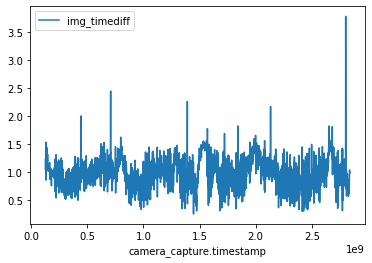
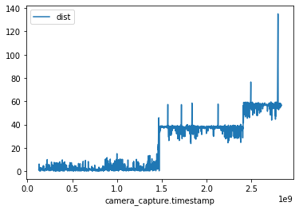

Postprocessing images
=====================

Install everything necessary for postprocessing:

.. code-block:: sh

   git clone git@github.com:BeagleSystems/pyulog
   cd pyulog 
   sudo python3 setup.py install
   cd ..

   git clone git@github.com:BeagleSystems/postprocessing
   cd postprocessing
   sudo python3 setup.py install

To run:

.. code-block:: sh

   align_dates

Select the .ulg PX4 log file and the folder containing all the images. The time parameters can be left as default. They only need to be adjusted when the time resolution of the output csv is not good enough.

Sentera
-------

Unsolved problems: Our postprocessing tool's output contains huge "steps" in the distance graph. So usually the distance between a photos geotag and the camera capture location is <10m. But as some photos are skipped, the distance increases to >30m.

.. code:: ipython3

    import pandas as pd
    data = pd.read_csv("/home/david/Downloads/nRGB übergabe mit Metadaten/output5.csv")

.. code:: ipython3

    import math
    import numpy as np
    
    
    def distance_to(lat1, lon1, lat2, lon2):
        r = 6371000.0
        dlat = np.radians(lat2 - lat1)
        dlon = np.radians(lon2 - lon1)
        a = np.sin(dlat/2)**2
        a +=np.cos(np.radians(lat1))*np.cos(np.radians(lat2))*np.sin(dlon/2)**2
        c = 2*np.arctan2(np.sqrt(a), np.sqrt(1-a))
        return r*c
    
    data["dist"] = distance_to(data["vehicle_global_position.lat"], data["vehicle_global_position.lon"], data["image_latitude"], data["image_longitude"])
    data["cc_timediff"] = data["camera_capture.timestamp"].diff() / 1e6
    data["img_timediff"] = data["image_timestamp"].diff()
    data["timediff"] = np.abs(data["cc_timediff"] - data["img_timediff"])

.. code:: ipython3

    x = data
    x.plot('camera_capture.timestamp', 'img_timediff')
    x.plot('camera_capture.timestamp', 'cc_timediff')
    x.plot('camera_capture.timestamp', 'dist')

.. code:: ipython3

    data["dist"].hist()

.. image:: postprocessing/output_4_1.png

